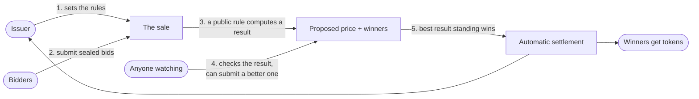

# Iceburg

**A fair, provable way to sell shares of a tokenized asset — instead of asking people to just trust the seller did it right.**

Built for the Arbitrum Open House Singapore Online Buildathon.

---

## Overview

When a company sells shares in its first public offering, or a real-world
asset gets tokenized and offered to buyers for the first time, someone has
to decide who gets how much, at what price. Today, that someone is an
underwriter — a middleman who takes everyone's interest, then allocates by
relationship, discretion, and whatever they decide is fair. Nobody outside
that room can check their work. This is a large part of why IPOs are
famously mispriced and why favored buyers routinely get better access than
everyone else.

Iceburg replaces that closed-door process with a public one. Buyers submit
sealed bids. A transparent rule — not a person — decides who wins and at
what price. And critically: **anyone can check the result, and anyone who
catches a wrong or unfair result gets paid for proving it.** The seller
can't quietly favor a friend, and nobody has to take their word that the
sale was run fairly, because the proof is public and checkable by design.

## The problem

Selling a new tokenized security or asset for the first time is harder than
selling an existing one, because there's no market price yet — someone has
to *discover* the price while also deciding who gets in. Sellers want
maximum revenue. Regulators and the market want a healthy, spread-out group
of owners, not one whale holding the whole thing. Buyers want confidence
they weren't shut out by favoritism.

Right now, resolving that tension is a black box:

- The seller (or their underwriter) picks the winners by hand.
- The stated rules — "no one buyer over 15%," "at least 25 different
  holders" — are promises, not guarantees. Nothing stops the seller from
  quietly breaking their own rules once real money is on the table.
- If a buyer feels shortchanged, there's no way to check — the allocation
  logic lives in someone's head or spreadsheet, not anywhere inspectable.

## Who it's for

**The issuer** — a company or project bringing a tokenized security to
market — who wants to run a raise that's provably fair, not just claimed to
be, because that's what serious buyers and regulators are starting to
expect.

**The bidder** — anyone participating in the sale — who wants to know that
if they didn't win, it's because the rules genuinely didn't favor them that
round, not because someone with a better relationship got the shares
instead.

## What it does

1. **The issuer sets the rules up front** — how many units are for sale,
   the lowest acceptable price, the most any one buyer can walk away with,
   and the minimum number of different buyers the sale must end up with —
   and those rules are locked in before a single bid comes in. The issuer
   can't change them later after seeing who bid what.
2. **Buyers submit sealed bids** — how many units they want, and the most
   they're willing to pay. Bids are hidden until everyone's has been
   submitted, so nobody can see and react to anyone else's offer.
3. **A public rule computes the sale price and who gets what** — the price
   that clears the most units while respecting every rule the issuer set,
   including the ownership-spread requirement.
4. **Anyone can double-check the result — and get rewarded for finding a
   better one.** If the proposed outcome shortchanges buyers or the seller,
   or quietly breaks one of the issuer's own rules, anyone watching can
   submit a better result and claim a reward. Only a result nobody can
   improve on within the review window actually goes through.
5. **The sale settles automatically.** Winners receive their tokens and pay
   the agreed price; everyone else gets their money back — no manual
   step, no possibility of the seller just deciding differently at the end.

## Why this isn't just an auction with extra steps

The interesting part isn't the auction — sealed-bid auctions are old news.
It's step 4: **nobody, including the issuer, has to be trusted to run the
sale honestly**, because anyone can hold the result to the issuer's own
stated rules and get paid for catching a violation. Most "fair allocation"
promises today are just that — promises. Here, breaking your own rules
isn't a PR risk, it's a mechanism that costs you money.

## How it works, at a glance



## Status

Early build for the Arbitrum Open House Singapore Online Buildathon
(September 13 – October 4, 2026).

---

## Running it locally

- `contracts/` — Foundry (Solidity) smart contracts.
- `iceburg-ui/` — React + TypeScript + Vite + Tailwind frontend, wired to the contracts via wagmi/viem + RainbowKit.
- `scripts/sync-abi.mjs` — copies compiled ABIs + the latest local deployment address from `contracts/` into `iceburg-ui/src/contracts`, so the frontend always has a typed, up-to-date view of the contracts.

### Local dev loop

1. **Start a local chain** (in `contracts/`):
   ```
   make anvil
   ```
2. **Deploy the protocol's singleton contracts** (in another terminal, `contracts/`) — the demo payment token, the attestor registry (with the demo attestor pre-approved), and the issuance factory:
   ```
   make bootstrap-local
   ```
   Each offering itself (`Issuance` + its `SecurityToken`) is created later, live, by calling `IssuanceFactory.createIssuance` from the issuer console — there's no static address to deploy or sync for those two; the frontend reads the real addresses back from the transaction receipt.
3. **Run the frontend** (in `iceburg-ui/`):
   ```
   npm run dev
   ```
   Connect a wallet (e.g. MetaMask) pointed at `http://127.0.0.1:8545`, chain id `31337`, and import one of anvil's printed dev private keys to get test ETH.

After changing a contract: `forge build` (or just re-run `make deploy-local SCRIPT=...` / `make bootstrap-local`) to pick up ABI changes in the frontend.

### Adding a new contract

1. Write it in `contracts/src/`, add a deploy script in `contracts/script/`.
2. Add it to the `CONTRACTS` list in `scripts/sync-abi.mjs` — a contract with one static address gets `{ name, broadcastScript }`; a contract created dynamically at runtime (like `Issuance`/`SecurityToken`, deployed per-offering by the factory) gets `{ name, deployed: false }` instead, which skips the broadcast-address lookup and exports the ABI only.
3. Run `make deploy-local SCRIPT=<File.s.sol>:<ContractName>` (for a `deployed: true` contract) — it'll show up as a typed export from `iceburg-ui/src/contracts`.

### Environment

- `contracts/.env` (copy from `.env.example`) — local anvil private key by default; fill in `SEPOLIA_RPC_URL` / `ETHERSCAN_API_KEY` only for testnet deploys.
- `iceburg-ui/.env.local` (copy from `.env.example`) — `VITE_WALLETCONNECT_PROJECT_ID` from https://cloud.reown.com (needed for WalletConnect-based wallets; injected wallets like MetaMask work without it).

## License

Apache License 2.0 — see [LICENSE](LICENSE).
